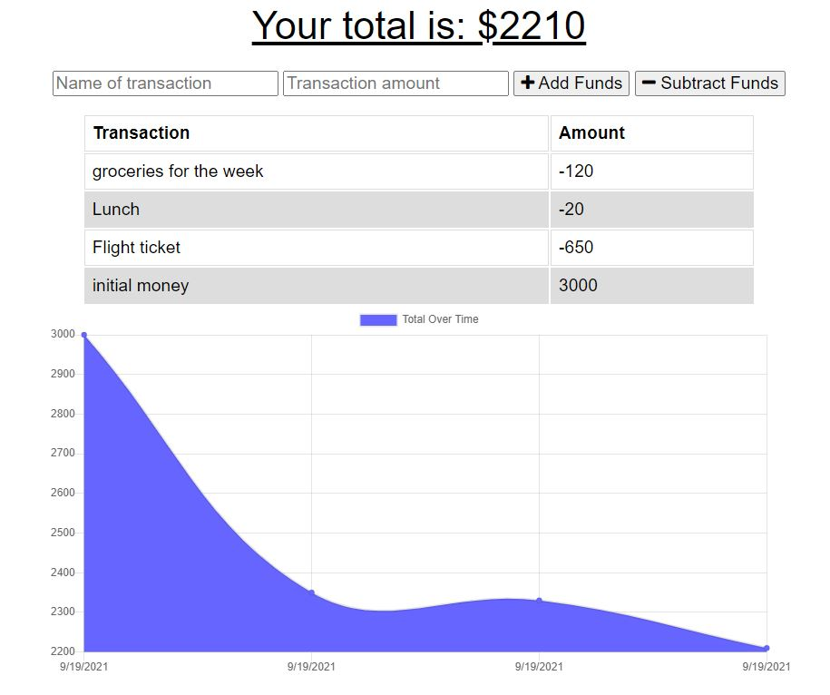

# Budget Tracker 

## Description

Budget Tracker is a PWA application designed to be usable in condition with poor internet connection. 

## Table of Contents

- [Installation](#installation)
- [Usage](#usage)
- [License](#license)
- [Contributing](#contributing)

## Installation

Click on the link provided bellow to use the application. The application can also be be installed locally on the personal computer by cloning this repository.

## Usage

Simple app to track someones budget, start with initial funds and add or substract anytime there is a change in the budget. There is a field provided to add description to a transaction, a helpfull graph will autogenerate to provide a visual to the current budget situation.

## License

### MIT

This application is covered under the MIT license. To learn more about this license,
please click the link. [MIT](https://choosealicense.com/licenses/mit/)

## Screen shot and link to application

[Budget-Tracker](https://young-mesa-16567.herokuapp.com/)

